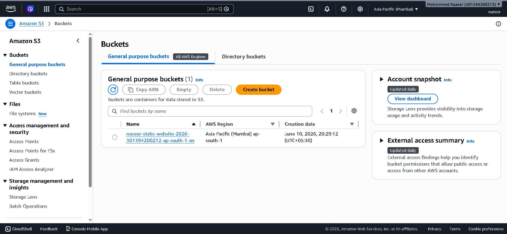
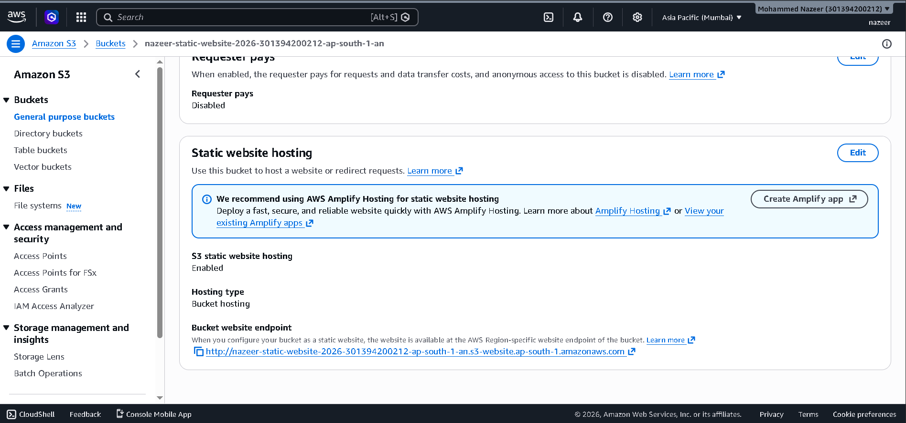
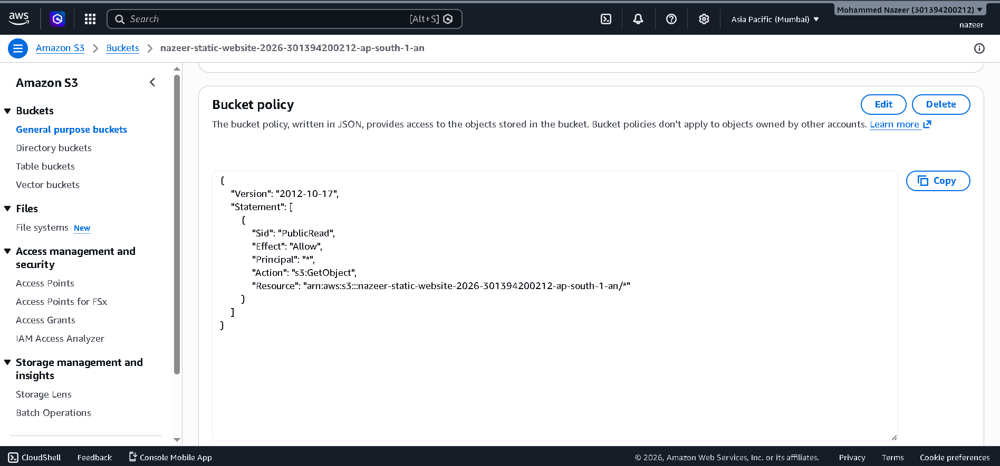
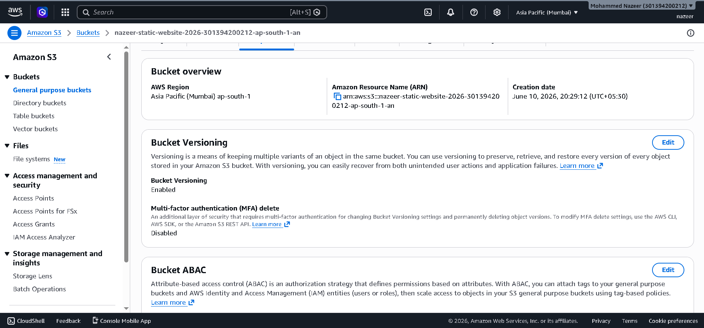
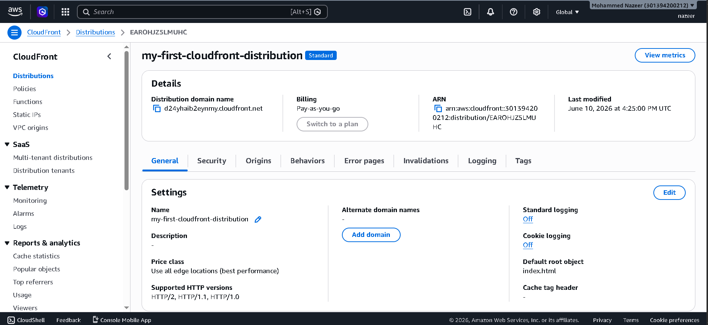
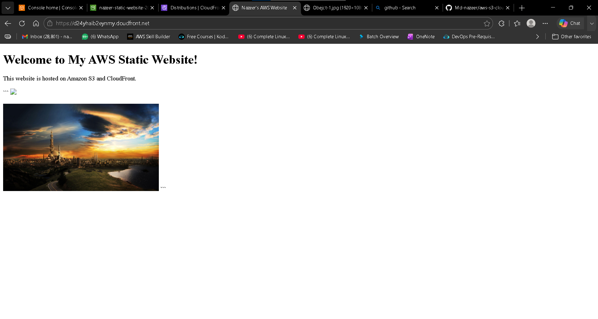

# AWS S3 Static Website Hosting using CloudFront

## Project Overview
This project demonstrates hosting a static website on Amazon S3 and delivering content globally using Amazon CloudFront.

## Services Used
- Amazon S3
- Amazon CloudFront
- AWS CLI
- S3 Versioning

## Features
- Static website hosting
- Public access configuration
- CloudFront content delivery
- HTTPS website access
- S3 object versioning
- Website deployment using AWS Console

## Architecture

User
   |
CloudFront
   |
Amazon S3 Bucket

## Project Steps
1. Created S3 bucket
2. Uploaded website files
3. Enabled Static Website Hosting
4. Configured Bucket Policy
5. Enabled Versioning
6. Created CloudFront Distribution
7. Configured Default Root Object
8. Verified website accessibility

## Outcome
Successfully deployed a static website using Amazon S3 and CloudFront.

## Project Screenshots

### S3 Bucket

### Static Website Hosting

### Bucket Policy

### S3 Versioning

### CloudFront Distribution

### Live Website

